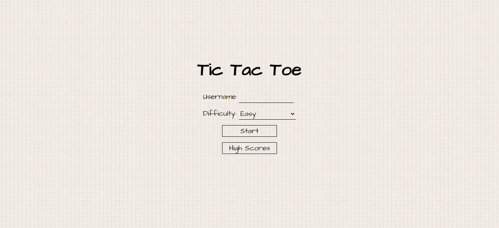

# Tic tac toe game


The project has been built with Golang, ReactJS and MariaDB.

To run the project you need to install: Node v12.18.3+ and Golang v1.15.2+

You need to configure your DB and run the SQL queries in the `ddl.sql` file. Then edit the `env.go` file according to your credentials.

Navigate to back-end folder and run:
```
go build .
```
And run the executable file according to your OS. The back-end will run on port 8080.

Navigate to front-end folder and run:
```
npm install
npm start
```
The front-end will run on port 3000.

About project flow:
* The back-end response with 3 seconds delay to client moves.
* The front-end retries the request while back-end making move.
* When a game is created, it's key is stored in local storage. So, user can resume if he/she leave the game without finishing.
* Teh game key is deleted after finishing the game.
* If there are any proplem with request. The request is sent with exponential back-off.
* The application can run on multiple instances.
